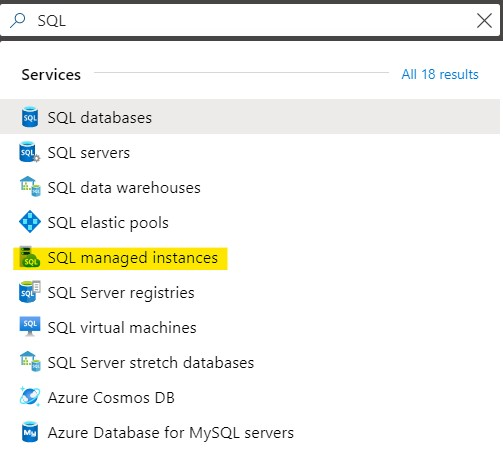
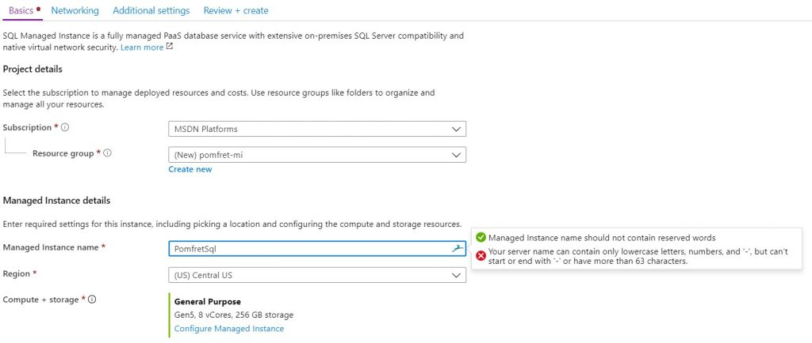
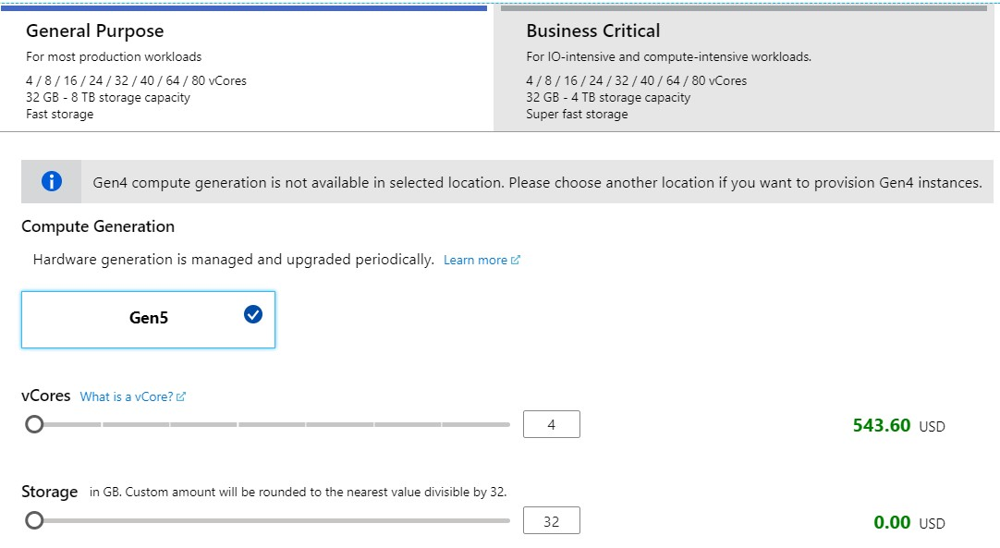
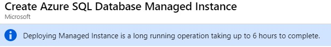

I’ve been thinking about the cloud a lot lately, and I feel it’s an area that I would benefit from learning more about. I’ve attended a couple of presentations on SQL Managed Instances and have read enough to be dangerous (or accidentally spend a lot of money, one of my biggest fears when working in the cloud). However, I always find I learn best and really get to understanding a topic by building something.

This post will be the first in at least a two part series on SQL Managed Instances (MI). My goal in this post is just to deploy an MI and have it ready to use for my next post.

I’ve chosen to start with MI as it feels like the easiest route to the cloud. Microsoft advertises an easy ‘Lift & Shift’ experience to move your on-premise applications to the cloud and offers “near 100% compatibility with on-premise”. Along with these you still get the existing benefits from using a SQL Database (PaaS) with reduced administration and management needs.

You can read more about the specifics of “Azure SQL Database managed instance”, including pricing, in the [Microsoft docs](https://docs.microsoft.com/en-us/azure/sql-database/sql-database-managed-instance).

## **Creating a SQL managed instance**

Step one is to head to the portal ([https://portal.azure.com](https://portal.azure.com/)) and get logged in. From there you can search ‘SQL’ and then select ‘SQL managed instances’.

On the next pane you’ll see any existing managed instances you have setup. I have none at this point so I’ll select the ‘+Add’ button on the toolbar to start creating one (One thing to note in this blog post, Azure changes often and quickly so these screenshots and steps might not be exact by the time you get to reading this).

### Basics

The creation wizard takes you through several tabs. The first ‘Basics’ is where you’ll create a resource group (to group like resources and easily manage them), name your server, size your server, and setup the administrator account (cut off in the below screenshot).  Your server name can’t contain reserved words, and also can only contain lowercase letters, numbers and a hyphen.

To size your managed instance you’ll need to choose between the two tier options. Business critical has faster disks (local SSD) for high I/O workloads and built in high availability with Always On. For today we’re going to stick with a general purpose instance.

An interesting note here is that I chose the smallest managed instance I could, and if I selected the same in different regions the price estimation was slightly different.

### Networking

On the networking tab you will create a virtual network for your managed instance to live in. You can also define the connection type (proxy or redirect) and enable a public endpoint. If you enable the public endpoint your managed instance will be available over the internet, which adds some security considerations that should be fully understood before simply enabling the option.

### Additional Settings

The third and final settings tab allows you to configure your instance collation and time zone. The default time zone is UTC so you might want to change that to match your usual time zone for servers you build on premise.

### Review & Create

The final tab reviews your settings to ensure they are all valid and allows you to create your managed instance. Depending on whether this also requires changes to the underlying cluster that your managed instance will be deployed on top of, this operation could take a while. Since this is my first managed instance I don’t have an existing cluster so Azure warns me this could take up to 6 hours to complete.

## Until Next Time

It’s really quite simple to get a managed instance created. There are not too many decisions to make along the way. I imagine the most important part is to understand the networking aspect to ensure we’re going to be able to securely connect to the database from the application.

Once my underlying cluster is created and my managed instance is ready to go the next step will be to migrate some databases from my on-premise lab up into the cloud.
