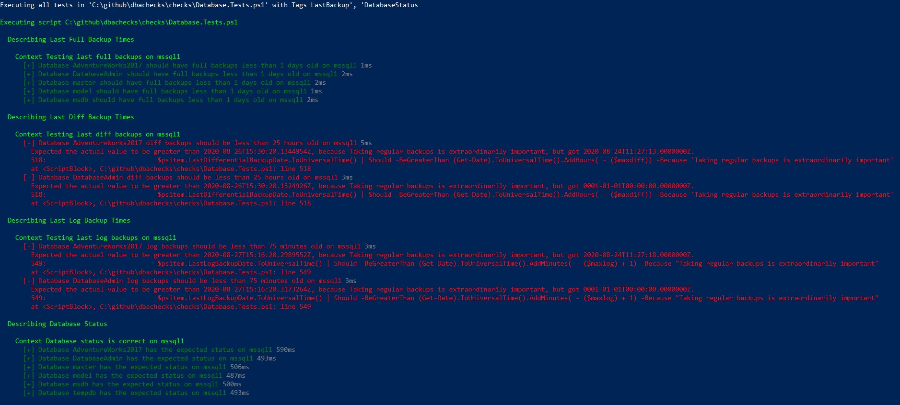
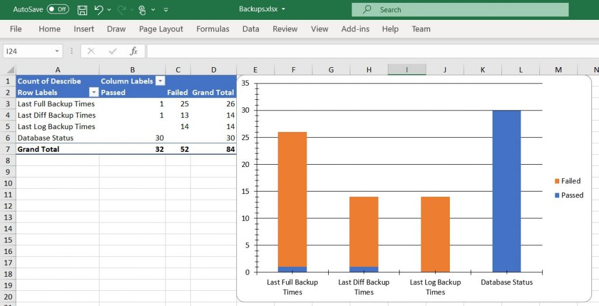

I got a message from a friend on Twitter last night asking ‘Is there an easy way to get dbachecks backup info into an Excel spreadsheet?’.  I sent them a couple of ideas, but figured this is a great use case that many people might be interested in. Pairing infrastructure testing using dbachecks with creating Excel reports with the ImportExcel module is a great addition to your automation tool belt. I also had ImportExcel on my mind this week after watching some great demos from Mikey Bronowski ([b](https://www.bronowski.it/blog/2020/06/powershell-into-excelimportexcel-module-part-1/)|[t](https://twitter.com/mikeybronowski)) at a user group earlier this week.

## **Run the Checks**

First step is to run some checks. I’ve previously written about using [dbachecks to check on your SQL Server database backups](https://jesspomfret.com/checking-backups-with-dbachecks/), so I’m going to use that as a base here.

I’m not going to change any of the configuration options, but that is covered in the post I linked to above. I am going to add the `DatabaseStatus` check with the default configuration to ensure all my databases are online.

$sqlinstances = 'mssql1','mssql2','mssql3','mssql4'
$testResults = Invoke-DbcCheck -SqlInstance $sqlinstances -Check LastBackup, DatabaseStatus -PassThru

You can see I have a nice balance of green (passed tests) and red (failed tests). Not really the balance we’re looking for in production, but perfect for a demo environment.

Using the `-PassThru` parameter means that the test results are both displayed on screen and saved to my $testResults variable. We’ll use that to create our report.

## **Create the Report – Option 1: Export-Csv**

The first option we have here is to just get the data into a csv. We can do that natively in PowerShell using the `Export-Csv` function.

$testResults.TestResult |
Select-Object Describe, Context, Name, Result, FailureMessage |
Export-Csv c:\\temp\\backups.csv -NoTypeInformation

This will get our data into a csv, which we can then manipulate in Excel.

## **Create the Report – Option 2: Export-Excel**

The second option is to use the ImportExcel module. This is easily in my top 5 all-time favourite PowerShell modules. With this module we can create a great looking Excel report in just a few lines. The following will take our test results and create two worksheets in one Excel file.  The first sheet will contain our raw data, formatted as an Excel table with some conditional formatting to highlight the failed tests. The second tab will contain a pivot table/chart of our results broken down by the test type and result.

$ConditionalFormat =$(
    New-ConditionalText -Text Failed -Range 'D:D'
)

$excelSplat = @{
    Path               = 'C:\\Temp\\Backups.xlsx'
    WorkSheetName      = 'TestResults'
    TableName          = 'Results'
    Autosize           = $true
    ConditionalFormat  = $ConditionalFormat
    IncludePivotTable  = $true
    PivotRows          = 'Describe'
    PivotData          = @{Describe='Count'}
    PivotColumns       = 'Result'
    IncludePivotChart  = $true
    ChartType          = 'ColumnStacked'
}

$testResults.TestResult |
Select-Object Describe, Context, Name, Result, FailureMessage |
Export-Excel @excelSplat

The final results are shown below. With so many more checks available in the dbachecks module it would be easy to expand on this example and get a comprehensive report of your environment.

The full script is available on [my Github](https://github.com/jpomfret/demos/blob/master/BlogExamples/06_dbachecksToExcel.ps1) demos repo.

Results Worksheet:

Pivot Table/Chart:

