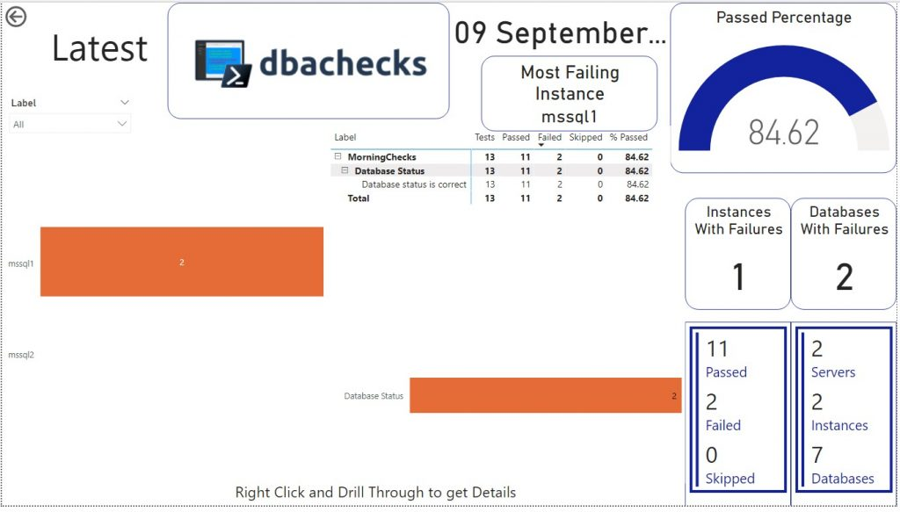
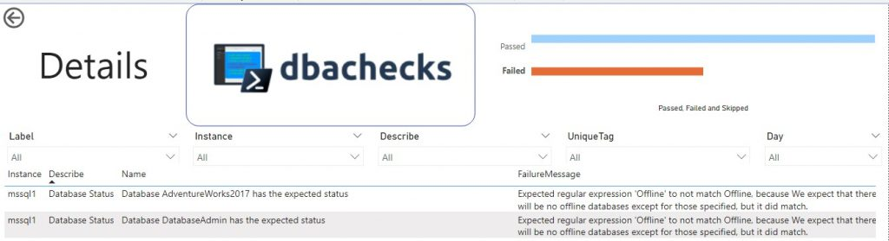

Thanks to Elizabeth Nobel ([b](https://sqlzelda.wordpress.com/)|[t](https://twitter.com/SQLZelda)) for hosting this month’s T-SQL Tuesday party and apologies for being as late as possible to the party! I love the topic of automation so felt sure I’d write something and then time slipped away. Luckily Mikey Bronowski ([b](https://www.bronowski.it/blog/)|[t](https://twitter.com/MikeyBronowski)) convinced me that it wasn’t too late to write something on my lunch break today (Wednesday in the UK) as it’s still Tuesday on Baker Island. Interesting fact Baker Island uses UTC-12:00 because since it’s uninhabited the islands time zone is unspecified ([Wikipedia](https://en.wikipedia.org/wiki/Baker_Island)).

## Automating dbachecks with scheduled task

I wanted to write about automating your daily checks with dbachecks, there are many ways of expanding on this post, but this should give you a good basis to build from.

### The environment

I have two docker containers running on my laptop, one running SQL Server 2017 and one running SQL Server 2019. I will use these SQL Server instances to run my sample daily checks against.

I have also created a database on the 2019 instance (mssql2) called dbachecks to store our daily check results.

### The checks

There are hundreds of checks available within the dbachecks module, and on top of that you can even [write your own](https://nocolumnname.blog/2018/02/22/adding-your-own-checks-to-dbachecks/) and include those. For this example I’m going to use the ‘DatabaseStatus’ check to ensure all my databases are online as expected.

### The automation

To automate the running of our daily checks we’ll first create a PowerShell script and then schedule that using task scheduler.  If you have other enterprise scheduling tools available you could easily use those instead to invoke the PowerShell script.

The script for my example, shown below, is pretty simple. I have a section to define where the data will be stored (the ability to save dbachecks result information straight into a database was introduced with dbachecks 2.0 and so I would highly recommend updating if you’re on an earlier version).

The next section (lines 7-9) lists my SQL instances that I want to check, and the checks that should be run.  The list of SQL instances could easily be pulled from a text file, a central management server (CMS) or a database to enhance the script.

The final three lines (lines 11-13) run the checks, apply a label of ‘MorningChecks’ (this allows for grouping of test results in the reports) and then inserts the results into the database.

Import-Module dbachecks, dbatools

## Dbachecks Database Connection
$dbachecksServer = 'mssql2'
$dbachecksDatabase = 'dbachecks'

## Define instances and checks to run
$SqlInstance = 'mssql1','mssql2'
$checks = 'DatabaseStatus'

Invoke-DbcCheck -SqlInstance $SqlInstance -Checks $checks -PassThru |
Convert-DbcResult -Label 'MorningChecks' |
Write-DbcTable -SqlInstance $dbachecksServer -Database $dbachecksDatabase

I saved this script to `C:\dbachecks\dbachecks.ps1` and then ran the following PowerShell to schedule the execution of the script daily at 7am.

$RunAs = Get-Credential
$taskSplat = @{
    TaskName    = 'Daily dbachecks'
    Action      = (New-ScheduledTaskAction -Execute 'powershell' -Argument '-File dbachecks.ps1' -WorkingDirectory C:\\dbachecks)
    Trigger     = (New-ScheduledTaskTrigger -Daily -At '07:00')
    User        = $RunAs.UserName
    Password    = ($RunAs.GetNetworkCredential().Password)
    RunLevel    = 'Highest'
}
Register-ScheduledTask @taskSplat

It’s important to note that the account used to run this scheduled task needs to be an account that has access to all of the SQL instances you want to check, as well as the SQL instance you are writing the final data to.

### Results

Since this is now scheduled daily we can grab our morning coffee, sit down at our desk and immediately review our estate and ensure everything is as expected.

We wrote the data to a SQL Server so you can go and query the data directly. By default there will be two tables created in the database.

- CheckResults – contains the actual results of the checks against your server
- dbachecksChecks – contains the metadata of the checks including tags and descriptions for each check you have invoked.

The other option is to use the dbachecks PowerBi dashboard, by running the following you can load the dashboard and connect to your dbachecks results database:

Start-DbcPowerBi -FromDatabase

When this opens you can see there were some failures on mssql1, right clicking on the orange bar you can drill through to see the details.

On the details pane you can see there are two offline databases that I need to look into.

### Summary

Finally, this automation is just the starting piece of automating your daily checks. There are many ways to expand on this, but this is how you can get started with automating daily health checks with dbachecks.

Thanks again for hosting, and sorry for being so late!
