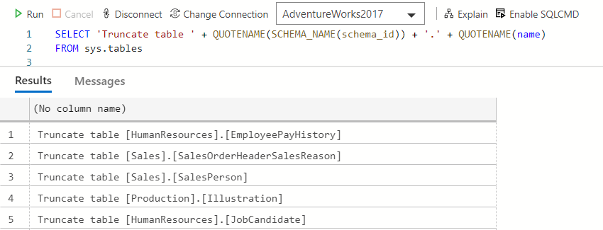

**TLDR**; [This code](https://github.com/jpomfret/demos/blob/master/BlogExamples/05_TruncateAllTables.ps1) will script out foreign keys and views (including object level permissions), drop the objects, truncate all the tables, and recreate the objects.

## The Details

The most popular post on my blog so far was called ‘[Disable all Triggers on a Database](https://jesspomfret.com/disable-all-triggers/)’ and this one is a good follow up from that post.

The scenario here is you need to remove all the data from the tables in your database. This could be as part of a refresh process, or perhaps to clear out test data that has been entered through an application.  Either way, you want to truncate all the tables in your database.

Using a copy of the AdventureWorks2017 database for my demos, the easiest option to truncate all the tables is to script out truncate statements using the metadata stored in `sys.tables`.

SELECT 'Truncate table ' + QUOTENAME(SCHEMA\_NAME(schema\_id)) + '.' + QUOTENAME(name)
FROM sys.tables

You’ll get a results set like shown below which you can copy out into a new query window and execute.

The problem is if you have foreign keys, even if you order the truncate statements to remove the dependent data first, you can’t issue a truncate statement. The way around this is to script out the foreign keys, drop them, run the truncate statements and then recreate the foreign keys. This is not difficult in T-SQL, but it’s easier with PowerShell and a little bit of [dbatools](https://dbatools.io/) magic.

## Truncate tables with PowerShell

The full script is available up on my [Github](https://github.com/jpomfret/demos/blob/master/BlogExamples/05_TruncateAllTables.ps1), but I’ll walk through the process here. During my post on disabling triggers I stored the previously enabled triggers in a variable to reuse during the script.  I had a really great comment on this post that pointed out a problem: if the session crashed for some reason we would lose the list of triggers we wanted to enable. I will solve that problem in this post by instead of using a variable, saving the information in a temporary file.

First things first, we need to set up a couple of variables to define our SqlInstance, database and the folder we’ll use as our workspace.

I’ll then use `Connect-DbaInstance` to connect to the instance and save the smo object. This will save having to reconnect to the instance multiple times.

$sqlInstance = 'mssql1'
$database = 'AdventureWorks2017'
$tempFolder = 'C:\\temp'

$svr = Connect-DbaInstance -SqlInstance $sqlInstance

The next step is to collect the foreign keys that we’ll need to drop and recreate. It’s important to note here there are also some views that depend on these tables, so I can also collect that information at the same time. 

\# Collect up the objects we need to drop and recreate
$objects = @()
$objects += Get-DbaDbForeignKey -SqlInstance $svr -Database $database
$objects += Get-DbaDbView -SqlInstance $svr -Database $database -ExcludeSystemView

Now that we have collected the objects into a variable we can pipe this to the `Export-DbaScript` command to generate T-SQL scripts for both dropping and then recreating the objects. Something to take into consideration when dropping and recreating views is that if there are permissions set at the object level we need to include those in our create scripts.  We can use the `New-DbaScriptingOption` command to set the options we care about when we create the scripts.

Here we are including the permissions, the ‘ScriptBatchTerminator’, which will add ‘Go’ between objects, and finally setting the file type to ANSI.  When we call `Export-DbaScript` we can then use these options for the `-ScriptingOptionsObject` parameter.

\# Script out the create statements for objects
$createOptions = New-DbaScriptingOption
$createOptions.Permissions = $true
$createOptions.ScriptBatchTerminator = $true
$createOptions.AnsiFile = $true

$objects | Export-DbaScript -FilePath ('{0}\\CreateObjects.Sql' -f $tempFolder) -ScriptingOptionsObject $createOptions

We also need to script out the drop statements. To do that we’ll create another options object, this time setting `ScriptDrops` to true. Then we’ll again call `Export-DbaScript` with the `-ScriptingOptionsObject` parameter.

\# Script out the drop statements for objects
$options = New-DbaScriptingOption
$options.ScriptDrops = $true
$objects| Export-DbaScript -FilePath ('{0}\\DropObjects.Sql' -f $tempFolder) -ScriptingOptionsObject $options

Once we have the scripts safely in our temporary folder we’ll run three simple statements.

First, we’ll run the drop statements we scripted out.

Second, remember we saved the smo connection to our server in the `$svr` variable. We’ll use that to access all the tables in our database, pipe that to a `Foreach-Object` and call the `TruncateData` method.

Third, we’ll call `Invoke-DbaQuery` to recreate the foreign keys and the views we previously dropped.

\# Run the drop scripts
Invoke-DbaQuery -SqlInstance $svr -Database $database -File ('{0}\\DropObjects.Sql' -f $tempFolder)

# Truncate the tables
$svr.databases\[$database\].Tables | ForEach-Object { $\_.TruncateData() }

# Run the create scripts
Invoke-DbaQuery -SqlInstance $svr -Database $database -File ('{0}\\CreateObjects.Sql' -f $tempFolder)

The final step is to clear up the script files we saved to the temporary folder.

\# Clear up the script files
Remove-Item ('{0}\\DropObjects.Sql' -f $tempFolder), ('{0}\\CreateObjects.Sql' -f $tempFolder)

This script can be reused for any database that you may need to clear out. As I was writing this post, I realised this could probably be a dbatools command… watch this space. ?
