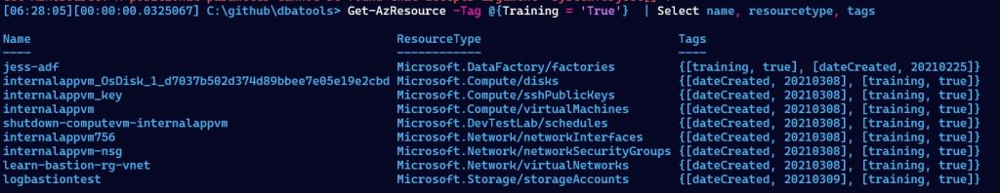
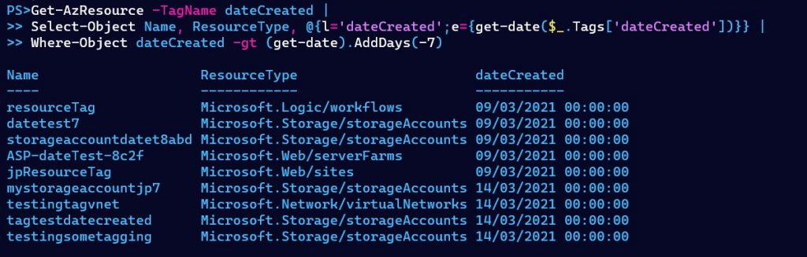

I’ve been working on some Azure exams recently, and I personally learn best by fiddling with things.  The [Microsoft learn](https://docs.microsoft.com/en-us/learn/) content is excellent, and I’d highly recommend that for any of the Azure exams I’ve taken so far.  However, I also like to build things myself and experiment a little with all the available options.

One of the vital parts of this learning and experimenting needs to be cleaning up after myself.  We all know the risks of leaving things running in Azure- it’s likely to drain your training budget pretty quickly.  To be fair, this is also a good lesson for real world scenarios. Getting used to turning off or scaling down resources based on need is a good way to reduce your Azure spend.

This brings me to one morning last week. I logged in to the portal and got a pop up that my credit was down to under $5, which is not what I was expecting. I started looking around and wondering what I’d left running – it isn’t always easy to spot though.

Luckily, John Martin ([b](https://jqmartin.info/)|[t](https://twitter.com/jqmtweets)) has instilled in me the importance of adding a tag for creation date on all resources, as it’s not tracked automatically. This means we can easily see what we last deployed and what we might have forgotten about.

In Azure, tags are just key value pairs that can be applied to resources and subscriptions to add metadata. You can use them to organise resources by environment, cost centre, business criticality, and anything else that might be important to your individual situation. There is a limit of 50 tags per resource. If you’re getting close to having 50 tags per resource you might need to rethink your tagging strategy to reduce the complexity.

You can view tags through the portal either through the dedicated ‘Tags’ pane, on each individual resource, or on the ‘Cost Management’ area. Here you can view your Azure spend broken down by tags, which can be very useful. You can also view tags using either the Azure CLI or PowerShell. I usually opt for PowerShell, so let’s have a look at how we can view resources with certain tags using the [Az module](https://www.powershellgallery.com/packages/Az/).  If you don’t already have the module installed you can run `Install-Module az` to get started. More details on prerequisites and options available can be found in the [Install Azure PowerShell with PowerShellGet](https://docs.microsoft.com/en-us/powershell/azure/install-az-ps?view=azps-5.6.0) docs.

## **Find resources with a certain tag**

I already mentioned I add a ‘dateCreated’ tag to all resources, but when I’m playing around in Azure and working through training courses I also add a ‘training’ tag and set the value to ‘true’.  This is an easy way for me to find all the resources I’ve created while training and clean them up.

We can easily list these resources in PowerShell using the following one liner:

Get-AzResource -TagName training -TagValue 'true' |
Select-Object Name, ResourceGroupName,ResourceType, Tags

If we’re ready to clean them up we can pipe the results from `Get-AzResource` straight into `Remove-AzResource`, ensuring we haven’t got anything left running and costing us credit.

Get-AzResource -TagName training -TagValue 'true' | Remove-AzResource

## **Resources created in the last x days**

Another useful snippet since we’re adding ‘dateCreated’ tags to all our resources is to get any resources that have been created in the last few days. Since I have formatted my dates as yyyy-MM-dd in my tags I can easily convert them into dates with PowerShell and then filter based on them.

Get-AzResource -TagName dateCreated |
Select-Object Name, ResourceType, @{l='dateCreated';e={get-date($\_.Tags\['dateCreated'\])}} |
Where-Object dateCreated -gt (get-date).AddDays(-7)

## **Resources without a tag**

The final tag related snippets I have for today is to make sure all our resources have the 'dateCreated' tag. Since currently I’m manually adding these tags there is a chance I forget or get lazy and some resources make it through without the tags.

We can find these tags by interrogating the key values of the tags:

Get-AzResource | where {$\_.tags.Keys -notcontains 'dateCreated'} |
Select-Object Name, ResourceType, Tags

Once we know which resources are missing tags we can easily update them using `Update-AzTag`, the operation parameter that controls what should happen if there are existing tags. Merge will ensure we don’t overwrite the current tags.

$resources = Get-AzResource -ResourceGroupName missingtag |
Where-Object {$\_.tags.Keys -notcontains 'dateCreated'}

Update-AzTag -ResourceId $resources.ResourceId -Tag @{'dateCreated' = (Get-Date -Format "yyyy-MM-dd")} -Operation Merge

The main problem with this whole idea is we are relying on whoever creates the resources to both remember to create the tag and put the values of the tag in a standard format.  Next week we’ll look at a couple of ways to automate this process.
