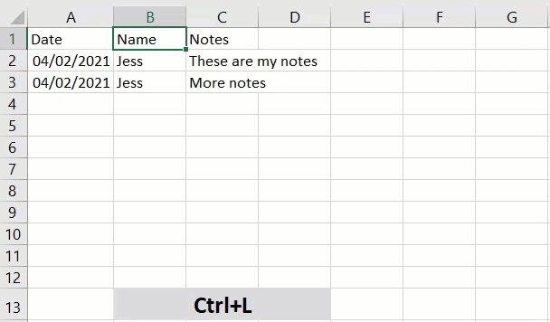
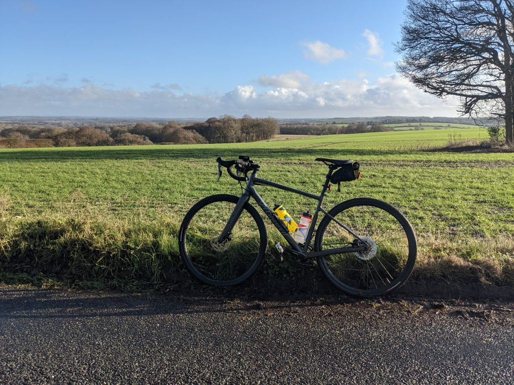

It’s time for February’s monthly blog party. This month is hosted by Mikey Bronowski ([b](https://www.bronowski.it/blog)|[t](https://twitter.com/MikeyBronowski)) and he’s asking us to write about our ‘tools of the trade’.  He’s looking for those tools that make our lives easier, ones we couldn’t imagine going without. Thanks for hosting Mikey, can’t wait to read everyone’s contributions and add some tools to my toolbelt.

I’m going to split this into a couple of sections. I’m sure you can all guess what’s up first though…

## PowerShell

If I could only choose one tool for my toolbelt it would be PowerShell, which is actually probably cheating because there are so many options to import modules and add functionality.  I’m going to highlight five modules I use a lot below.

1. [dbatools](https://github.com/sqlcollaborative/dbatools) – If you’ve read much of my blog before, or seen me present, it should be no surprise that dbatools is number one.  I use dbatools every day, whether it’s to check diskspace, update database owners, or a plethora of other uses.  In fact I previously wrote a post ‘[The Multitool of my DBA toolbox](https://jesspomfret.com/t-sql-tuesday-101/)’ that highlights five great use cases.
2. [dbachecks](https://github.com/sqlcollaborative/dbachecks) – A close friend of dbatools, dbachecks combines Pester and dbatools to create an amazing infrastructure testing module.  This is perfect for creating a morning checks dashboard, or quickly checking certain parts of your estate. For example, in my post ‘[dbachecks meets ImportExcel](https://jesspomfret.com/dbachecks-importexcel/)’ we check up on backups and database status before exporting to create an Excel report.
3. [Pester](https://github.com/pester/Pester) – Originally designed for unit/integration testing, I personally use this framework to test anything you can write in PowerShell. It quickly provides a clear and easy to read answer for whether everything is as expected. I’ve written about it previously to ‘[Pester test your Cluster Role Owners](https://jesspomfret.com/pester-test-cluster-role-owners/)’.
4. [ImportExcel](https://github.com/dfinke/ImportExcel) – This module lets you work with Excel objects, without having Excel installed.  Easily read data from spreadsheets into PowerShell, or export data to create detailed reports with a few lines of code. Our host for this T-SQL Tuesday has written a great series on this module, if you’re looking for inspiration. [importexcel Archives - Mikey Bronowski - Blog](https://www.bronowski.it/blog/tag/importexcel/)
5. [PSFramework](https://github.com/PowershellFrameworkCollective/psframework) – Finally, I want to highlight PSFramework.  Portions of this module are used within both dbatools and dbachecks.  It provides great options for both setting configuration options that can be then used in your modules as well as for creating great logging. I’ve switched to using Write-PSFMessage instead of Write-Host\\Verbose\\Output as it provides a lot more flexibility as well as writing to a physical log file.

I also recently wrote about [PowerShell’s interactive search functionality](https://jesspomfret.com/psreadline-search-history/), and after a poll on Twitter was pretty shocked by how few people knew about it.  I recommend checking it out, as it is a really handy built in feature.

https://twitter.com/jpomfret/status/1357014555638042624

## Microsoft Excel

Since I’ve written a lot about PowerShell previously, I wanted to highlight some other tools that I depend on. I’ve always been a fan of Excel, my personal life is full of spreadsheets – most decisions end with a spreadsheet (lucky for me, my wife is also a big fan of Excel!).  I often find myself copying data into Excel to keep track of work, or to quickly analyse data.  It’s also a great way of sharing data with a clear structure.  I’m also a big fan of shortcuts – so here’s a few I use often.

- **Ctrl+;** - Insert today’s date into the current cell – really useful, and avoids you having to remember we’re now in 2021!
- **Ctrl+l** – Select a cell within a dataset, press Ctrl+l (lowercase L), press enter. Your data is transformed into a table.

- **Ctrl+D** – Fill down, this will copy the contents of the cell above into your current cell.  Also smart enough to handle continuation of formulas.
- **Ctrl+R** – Fill right, same as above but it’ll copy the contents of the cell to your left into your current cell.
- **Ctrl+Up/Down arrow** – This will move your cursor to either the first value in the current column, or the last.  I use this a lot for navigating around worksheets/tables.
- **F2** – This edits a cell's contents. It puts your cursor at the end of the value, but you can now use your arrow keys to move about in the cell. It also stops you accidentally overwriting what was already in the cell.

## My Bike

My final tool is my bike. Not technical at all, but a tool I use to keep fit and have some fun.  I love cycling, and in the current times it’s my best option for fitness (I’m in England – we’re deep into lockdown 3 and gyms are closed). 

Honestly, I have a really hard time working out at home. I enjoy going to the gym, seeing some friendly faces and having someone tell me what to do for an hour.  It’s not the same at home, and my mood is instantly affected by not being active.

However, I’m happy to go out for a ride, and living in the South of England the weather is reasonably kind all year round.  Previously, living in Ohio there weren’t many options for winter bike riding, unless you had fat tyres and loved the snow!  I’m also lucky to be close to the South Downs (pictured below), as well as plenty of country lanes to explore.

## Summary

Thanks for reading and hope you’ve enjoyed digging through my toolbox. Thanks again to Mikey for hosting. I always enjoy participating in these T-SQL Tuesday’s, partly because it gives me a prompt to write about, partly because it’s fun to see what everyone else wrote about.

Stay safe folks.
